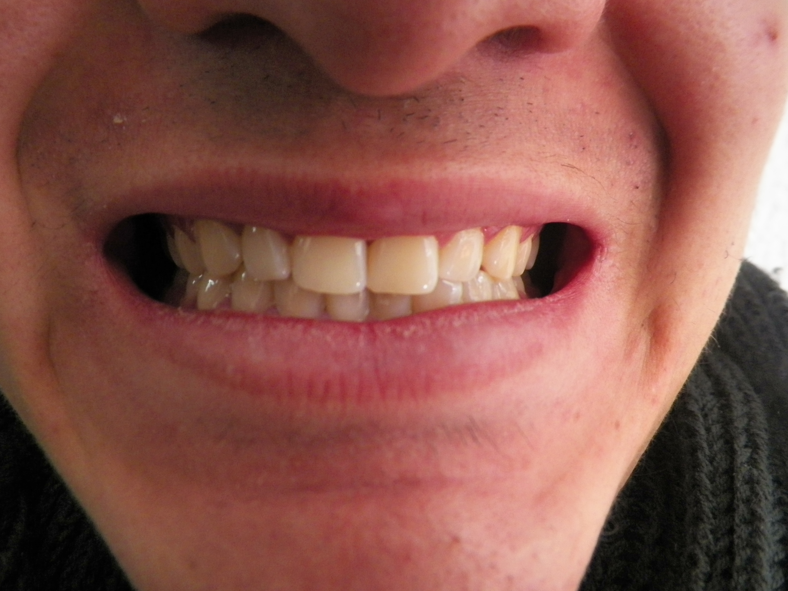
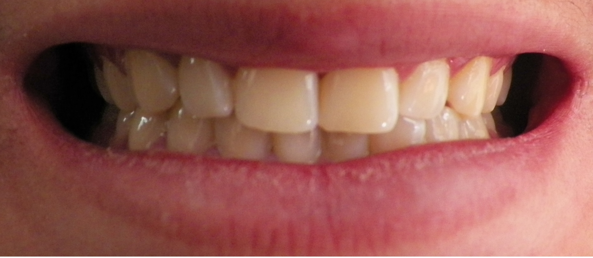
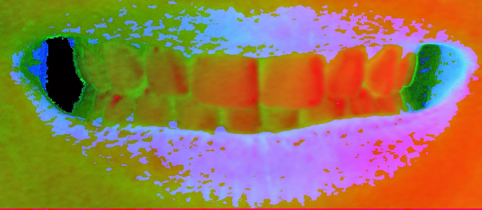
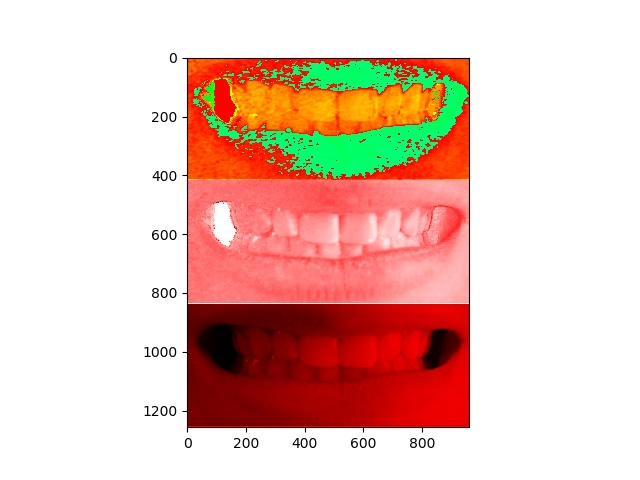
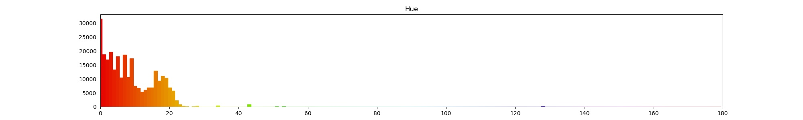
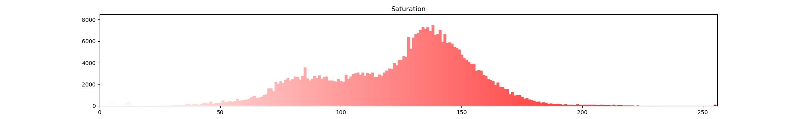
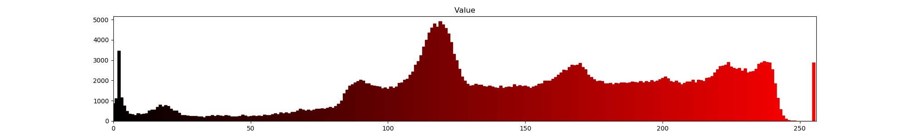
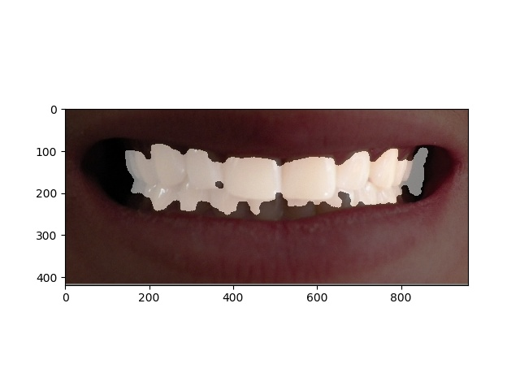

# Разработка ML алгоритма для приложения ColorDent 

[^1] подробнее о **ColorDent**

[^1]: **ColorDent** - мобильное приложение-помощник стоматолога для подбора коректной цветопробы пломбировочного материала на основе фотографии пациента.

В этом репозитории представлен код эмпирического сравнения различных алгоритмов обучения с учителем для автоматической детекции зубов человека на фотографии и мульти-классификации их оттенков. Выводится один общий подход, включающий: 

1) Чтение фотографий классом [ReadImages.py](Experiment/Source/ReadImages.py)

> Пример начального фото 

2) Препроцессинг фотографий через класс [PreProcessingData.py](Experiment/Source/PreProcessingData.py)

> Детекция нужного участка фото

> Различные канальные преобразования, например:

> Набор канальных изображений:

> Гистограммы для различных каналов:

3) Детекция зубов классом [TeethDetection.py](Experiment/Source/TeethDetection.py)

4) После всех преобразований вычисляются фичи и записываются в таблицы напротив соответствующих лейблов с помощью класса [FeatureExtraction.py](Experiment/Source/FeatureExtraction.py)

5) Наконец в классе [Classification.py](Experiment/Source/Classification.py) используется ансамбль моделей для классификации изображений по лейблам, соответствующим цвету определенного производителя. `Accuracy` ~ 92,8 %

## TO DO 

Необходимо добавить: 
* Мультиклассовая классификация изображений в зависимости от цветовой схемы различных производителей пломб.